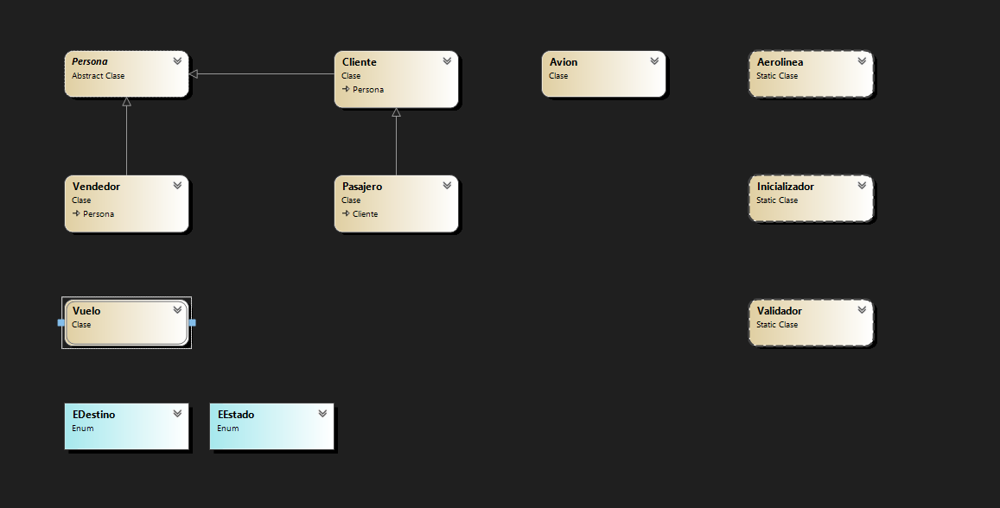

# Super Airline Management Console Lite Experience Service System 3.5 (SAMCLESS) Desktop Version

## Sobre Mi##

Soy Matias Barrozo, tengo 23 años y estoy actualmente estoy cursando la tecnicatura en programacion. Estuve haciendo este programa por casi 1 mes, y el programa
paso por mas de 1 diseño y muchas funcionalidades descartadas, pero estoy bastante contento con el resultado final. El mayor inconveniente fue el apartado grafico
ya que una vez que arranque a modificar un poco no pare de modificarlo hasta que este lo mas perfecto posible y esto consumio mucho tiempo. Durante este proyecto
aprendi mucho manejo de  forms, principalmente el uso de datagridview que se puede notar el uso por lo largo del programa.

## Resumen ##

La funcionalidad de la aplicacion depende del tipo de usuario con el que inicies, si el tipo de usuario es "usuario" solo podras ver estadisticas historicas, vuelos disponibles (ver su informacion y pasajeros) y vender un pasaje a estos vuelos.
El usuario administrador puede hacer lo mismo que un usuario mas la posibilidad de programar vuelos y hacer ABM de usuarios.
Se puede observar la funcion de cada uno de las distintas herramientas apoyando el mouse encima, esto da una pequeña descripcion de la funcionalidad del mismo.

Para acceder al programa se puede usar el boton de autocompletar que te trae un usuario aleatorio (si se quiere acceder con el administrador, el usuario es "pepe" y la contraseña "pepe").
Una vez iniciado podemos visualizar los vuelos disponibles, si queremos ver mas informacion seleccionamos y vamos a "mas informacion", tambien podemos vender un pasaje y ver los pasajeros del vuelo seleccionado.
Podemos agregar clientes directamente desde el menu principal.
El boton "vender" solo aparece si se selecciona un vuelo que pueda vender pasajes (es decir que el estado sea distinto a lleno o en vuelo) y el boton "pasajeros" solo aparece si se selecciona un vuelo.
En la pestaña de vender pasaje, primero hay que elegir un cliente que vaya a comprar los pasajes, se puede buscar con el buscador por nombre/apellido/dni, si el cliente no esta registrado podemos agregarlo con el boton "agregar cliente".
Una vez elegido el cliente podemos elegir la cantidad de pasajes que va a comprar y abajo nos mostrara el nombre del cliente que va a comprar los pasajes.Si se elije mas de un pasaje
a medida que se vayan cargando los pasajeros se mostrara su nombre en el recuadro que se encuentra en el medio, una vez cargado todos los pasajeros te mostrara una ultima vez los mismos con el precio final a pagar.
En la pestaña agregar vuelo, hay que llenar los distintos campos, la lista de aviones solo te muestra los aviones disponibles segun la fecha, si este avion tiene un vuelo programado en ese dia, no aparece.
En la pestaña de pasajeros podemos ver la informacion de los pasajeros cargados de ese vuelo.
El boton historico lleva a distintas estadisticas que se puede ver en el combo box. Podemos visualizar:

- Destinos: Todos los destinos, total facturado y cantidad de pasajeros que viajaron(ordenado por facturacion de manera descendente).

- Clientes Frecuentes: Se considera cliente frecuente a todo aquel que haya comprado mas de 2 pasajes.

- Ganancias Totales: Muestra todos los vuelos que se hicieron, clasificados en cabotaje o internacional segun corresponda.

- Vuelos Finalizados: Muestra todos los vuelos finalizados.

- Aviones: Muestra la informacion de todos los aviones.

- Vendedores: si es un usuario normal, muestra cierta informacion sobre los demas vendedores, si es un usuario administrador tambien permite hacer ABM de los mismos.

## Diagrama ##

## Justificacion Tecnica

- Tema Clases y metodos estaticos: Se usaron 3 clases estaticas: aerolinea, inicializador y validador. En aerolines se centralizan todas colecciones y variables que se usan
a lo largo del programa, como no es necesario instanciar esta clase se uso de manera estatica. Con respecto a las otras 2 clases una tiene todas las funciones de validacion y la otra inicializa
las colecciones historicas. Con respecto a los metodos estaticos se usaron
en situaciones en las cuales no iban a requerir de una instancia, o no estan enlazadas a ningun objeto, por ejemplo "CalcularRecaudacionTotal" en la clase "Aerolines" solo se va a usar una vez en el historico y no
requiere de una instancia.Con respeco a los namespaces se dividio en 2, uno es todo el entorno grafico y sus metodos, mientras que el otro son las entidades ajenas al apartado grafico.

- Tema Programacion orientada a objetos: 
  * Clases: En el programa se usaron 5 clases de instancia, porque se requeria abstraer atributos y funciones de ciertos objetos de la realidad, por ejemplo avion, pasajero, vuelo.
  * Objetos: Las instancias de las clases del programa se usan a lo largo del mismo, durante la generacion de colecciones, en altas de pasajeros, alta de cliente, alta de vuelos, etc;

- Tema Encapsulamiento: En todas las clases de instancia, se limito el acceso a sus atributos declarandolos como "private". En casos que es necesario setear, como por ejemplo en vendedores que se puede
modificar los valores, o en los contructores se usa la funcion de "set" validada para que no ingresen datos no deseados.

- Tema Enumerado: Se usa 2 enumerados para establecer valores que no se van a modificar durante tiempo de ejecucion, se usan para los distintos destinos y para los estados del vuelo.

- Tema Colecciones: Se usaron 2 colecciones, Principalmente la lista que se uso para guardar los objetos de aviones, vuelos,clientes, etc. Se uso tambien un diccionario para guardar los pasajeros
siendo el key el numero de asiento y el value un objeto de tipo pasajero.

- Tema Windows Forms: Esta herramienta se utilizo principalmente para la interfaz grafica, funcionalidad de botones, uso de datagrid, etc.

- Tema Herencia: Se uso herencia con las clase persona de la cual deriva cliente y vendedores, a su vez la clase la clase pasajero deriva de cliente. Estos se hizo para poder generalizar atributos
como por ejemplo el nombre y el apellido en el caso de persona, y el dni en el caso de cliente.

- Tema Polimorfismo: Se declaro la clase persona como abstracta, ya que no era necesario instanciarla en ninguna parte del programa. Se aprovecho de dicho tema para poder sobrescribir metodos
toString(), Equals(), GetHashCode(). Tambien se uso para un metodo abstracto de la clase persona ("MostrarInformacion()") la cual se sobrescribio tanto en la clase vendedor como en la clase
cliente.

## Propuesta de valor agregado:

Se agrego mas de una funcion que yo considero extra a la consigna que se plantea:

- Jerarquia de usuarios: Se establecieron que los distintos usuarios pueden ser administradores o usuarios, dependiendo del tipo de usuario cambia las acciones que pueden hacer en el programa, por ejemplo
un usuario no puede agregar vuelos mientras que un administrador si, tambien el administrador tiene la posibilidad de dar alta, baja y modificacion de los usuarios.

- Buscador: Se agrego un buscador en distintos datagrid que hay a lo largo del programa, estos indican por que valores se puede buscar.

- Modo oscuro: Si bien solo suma para el apartado visual, lo considero como tal por el trabajo que me llevo hacer que funcione.

- Funciona: Con esto me refiero que los vuelos se actualizan segun su hora de salida, tanto los vuelos hardcodeados como los nuevos, van a ir cambiando su estado a medida que va pasando las horas
es decir que si la hora actual llega a la hora de salida de un determinado vuelo, el estado de este cambiara a en vuelo y si pasa con la llegada cambiara a finalizado y automaticamente pasara
a la lista de vuelos finalizados.